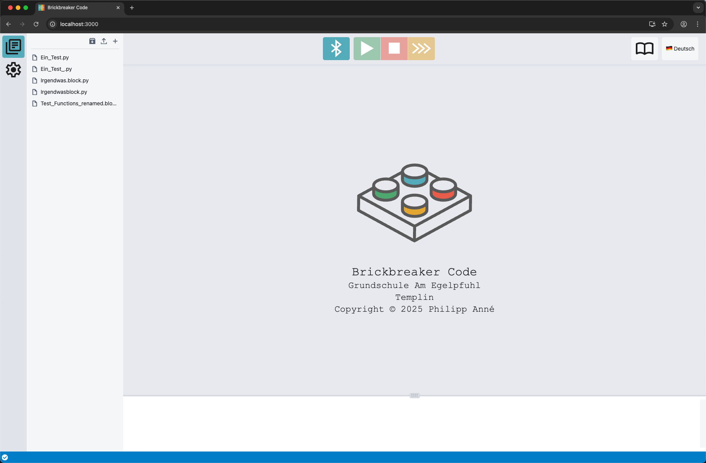
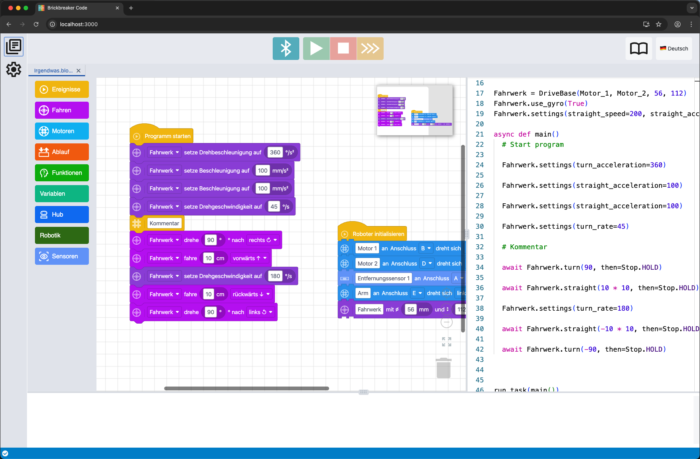

> [!IMPORTANT]  
> Dieses Projekt ruht bis auf Weiteres (d.h. vermutlich bis in alle Ewigkeit). Obwohl alles soweit funktioniert und uns bei der WRO 2025 eine Top-Platzierung ermöglicht hat1.
> Warum also? Ganz einfach: an meiner Schule stehen "nur" iPads für die Robotik AG zur Verfügung und bekanntermaßen unterstützt Safari `navigator.bluetooth` nicht.
>
> Es ist zwar nicht auszuschließen, dass sich das in naher Zukunft ändert. Trotzdem habe ich mit der Entwicklung eines neuen Projektes begonnen. Dies ermöglicht auf Basis von `Capacitor
> die Nutzung auch auf iPads (und auch Android Tablets). Außerdem verzichte ich auf die Unterstützung von direkter Quellcode-Eingabe ("Monaco-Editor"), was das Programm nochmal viel
> schlanker macht2. Zu guter Letzt hilft ein sauberes Aufsetzen auf Basis von React 19/Redux und Vite 7/Typescript 5.8 auch, einige Altlasten aus pybricks-code loszuwerden.
>
> Ich werde berichten.
> 
> 1 Die Möglichkeit, mit einem einzigen Befehl, Gyro-gesteuert gradeaus zu fahren, grenzt gegenüber der Lego-eigenen Lösung ein wenig an Wettbewerbsverzerrung - gerade in den unteren Altersklassen.
> 2 Wer direkt in Python entwickeln will, verwendet eh einen Laptop und ist mit pybricks-code bestens bedient. Meine Zielgruppe ist aber bekanntlich eine andere.

brickbreaker-code
=================

A web app for programming LEGO® Powered Up Smart Hubs with Pybricks MicroPython for use in a German elementary school and support of Blockly elements.

### Primary goal

Das Ziel ist, das Tool inkl. Unterstützung für Blockly-Entwicklung und vollständig auf Deutsch zur Verfügung zu stellen. 

Die Blöcke sollen dabei (nach heutiger Idee) nicht (nur) 1:1 die pybricks Python-Bibliothek abbilden, sondern für Grundschülerinnen und -schüler vereinfachte Programmiermöglichkeiten bieten.

Zielsystem ist primär LEGO® Education SPIKE™ Prime.

#### Milestones
- [x] Mai 2025 - eine erste Beta-Version bei der WRO 2025 zum Einsatz bringen 🤖

---

**Try it at <https://alpha.brickbreaker.de>.**

**This is an alpha. And nothing will work.  
If it does: don't use it for anything serious.**

(0.1.0-alpha15 / 15.05.2025)

## Preview

https://github.com/user-attachments/assets/f2de55c8-6cba-4719-80b6-93c76d6f8f9c

---

## Next steps / wip

**This is still a prototype and a long way from being put to good use.**

- [x] save/load blockly data  
- [x] handle multiple editors
- [x] generate py code from blockly
- [x] create source map for generated py code (dev progress: https://youtu.be/bWZQiGOCs4I)
- [x] source map works both ways: block <> code
- [x] develop some useful blocks
- [x] run it on a real spike prime device (dev progress https://youtu.be/rxz_a8NYH68)
- [x] improve variable handling (dev progress https://youtu.be/X3-U1x4zmDw)
- [x] support user-defined methods
- [x] custom rendering for connection types
- [x] dark mode support
- [x] language selection (de/en)
- [x] develop some even more useful blocks (vars, parameters, etc.) (wip)
- [x] included some plugins: minimap / zoom-to-fit
- [x] __⇉ CURRENT__ 📌  implemented virtual coach
- [ ] cleanup code
- [ ] fix dependencies
- [ ] fix broken tests
- [ ] peace & love  

### Screenshot (more or less up to date)

---

<small>
LEGO® is a trademark of the LEGO Group of companies which does not sponsor, authorize or endorse this project.
</small>

