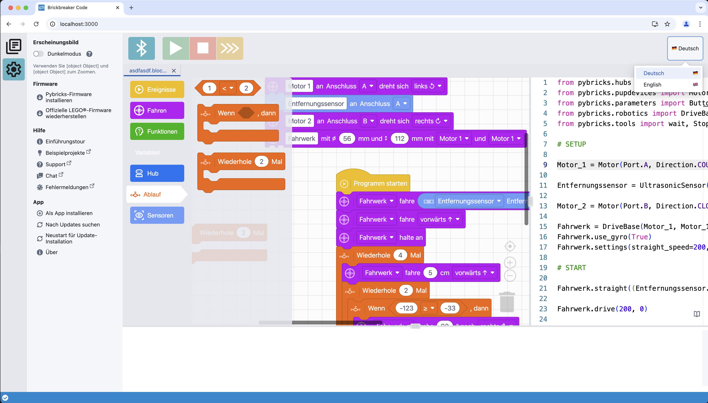

brickbreaker-code
=================

A web app for programming LEGO® Powered Up Smart Hubs with Pybricks MicroPython for use in a German elementary school and support of Blockly elements.

### Primary goal

Das Ziel ist, das Tool inkl. Unterstützung für Blockly-Entwicklung und vollständig auf Deutsch zur Verfügung zu stellen. 

Die Blöcke sollen dabei (nach heutiger Idee) nicht (nur) 1:1 die pybricks Python-Bibliothek abbilden, sondern für Grundschülerinnen und -schüler vereinfachte Programmiermöglichkeiten bieten.

Zielsystem ist primär LEGO® Education SPIKE™ Prime.

---

**Try it at <https://alpha.brickbreaker.de>.**

**This is an alpha. And nothing will work.  
If it does: don't use it for anything serious.**

(0.1.0-alpha2 / 01.04.2025)

---

## Next steps / wip

**This is still a prototype and a long way from being put to good use.**

- [x] save/load blockly data  
- [x] handle multiple editors
- [x] generate py code from blockly
- [x] create source map for generated py code (dev progress: https://youtu.be/bWZQiGOCs4I)
- [x] source map works both ways: block <> code
- [x] develop some useful blocks
- [x] run it on a real spike prime device (dev progress https://youtu.be/rxz_a8NYH68)
- [x] improve variable handling (dev progress https://youtu.be/X3-U1x4zmDw)
- [x] support user-defined methods
- [x] custom rendering for connection types
- [x] dark mode support
- [x] __⇉ CURRENT__ language selection (de/en)
- [ ] develop some even more useful blocks (vars, parameters, etc.)
- [ ] cleanup code
- [ ] fix dependencies
- [ ] fix broken tests
- [ ] peace & love  

### Screenshot (more or less up to date)

# Contributing

If you'd like to contribute, please fork the repository and use a feature branch. Pull requests are warmly welcome.

For more details, see the file [CONTRIBUTING.md](./CONTRIBUTING.md).

---

<small>
LEGO® is a trademark of the LEGO Group of companies which does not sponsor, authorize or endorse this project.
</small>

